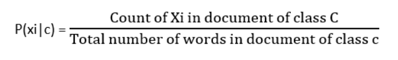
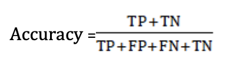
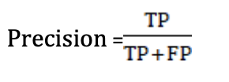
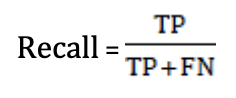

## Sentiment-Analysis-of-twitter-data
NLP based project that quantifies the mood of a tweet using 4 different algorithms and creates a model for future prediction.

## Important Formulas
#### The equation of the conditional probability of Naive Bayes algorithm

where,  
xi is a given term  
c is a predefined class label  

#### Accuracy

#### Precision

#### Recall

where,  
TP = True Positive  
TN = True Negative  
FP = False Positive  
FN = False Negative  

## 1.  METHODOLOGY
   The workflow is divided into three phases  
   i. Pre-processing  
   ii. Training  
   iii. Testing  

### i. Pre-processing 
  The tweets are pre-processed to filter some part of tweets which hold very less to zero significance in sentiment analysis.
  #### steps in preprocessing
  1. Emoji Extraction  
  2. Hyperlink Removal  
  3. Slang substitution  
  4. Timestamp removal  
  5. Digits removal
  6. Symbols removal  
  7. Spelling correction  
     * Shortening
     * Correction
  8. Proper nouns removal  
  9. Lemmatization  
  10. Stop words removal  
  
### ii. Training
The training process has two tasks,  
  * Creation of bag of words model  
  * Creation of predictive model  
  
### iii. Testing
In testing phase, the 30% of data randomly split from the dataset and is tested on the predictive model. The test data is pre-processed and classified either positive or negative.

[click here for complete Details](https://www.irjet.net/archives/V6/i5/IRJET-V6I5239.pdf)
